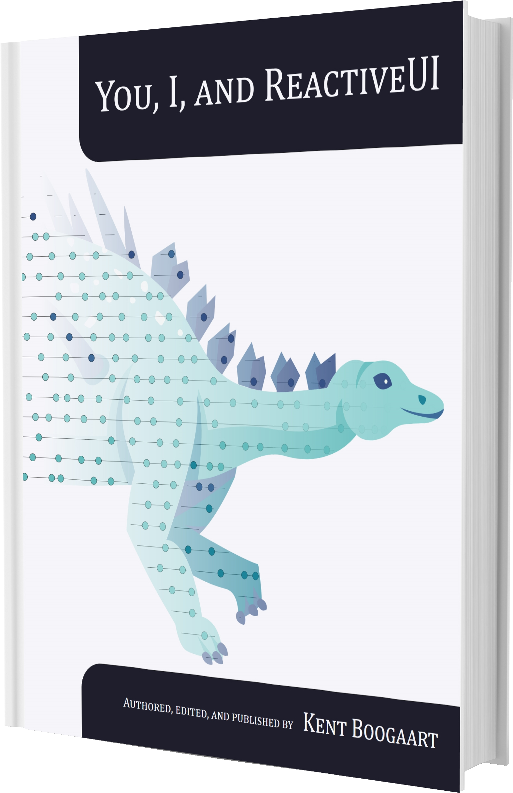
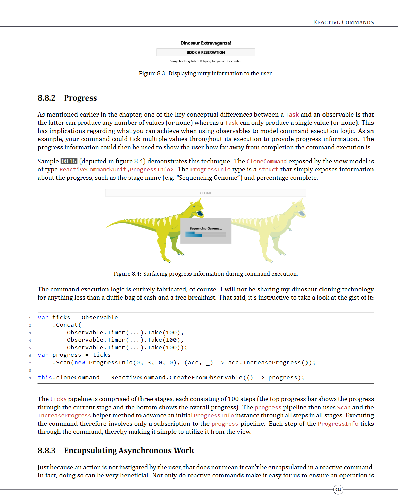
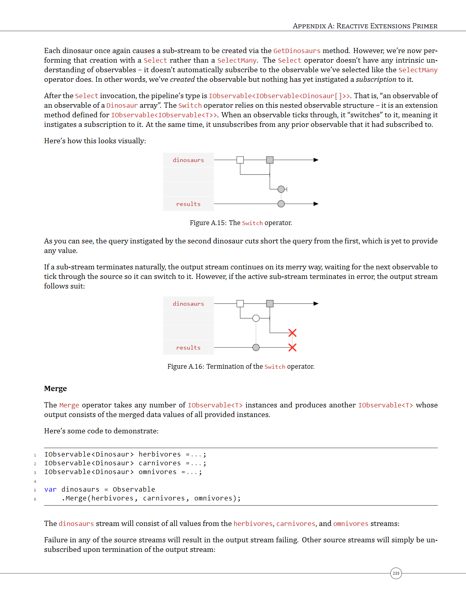
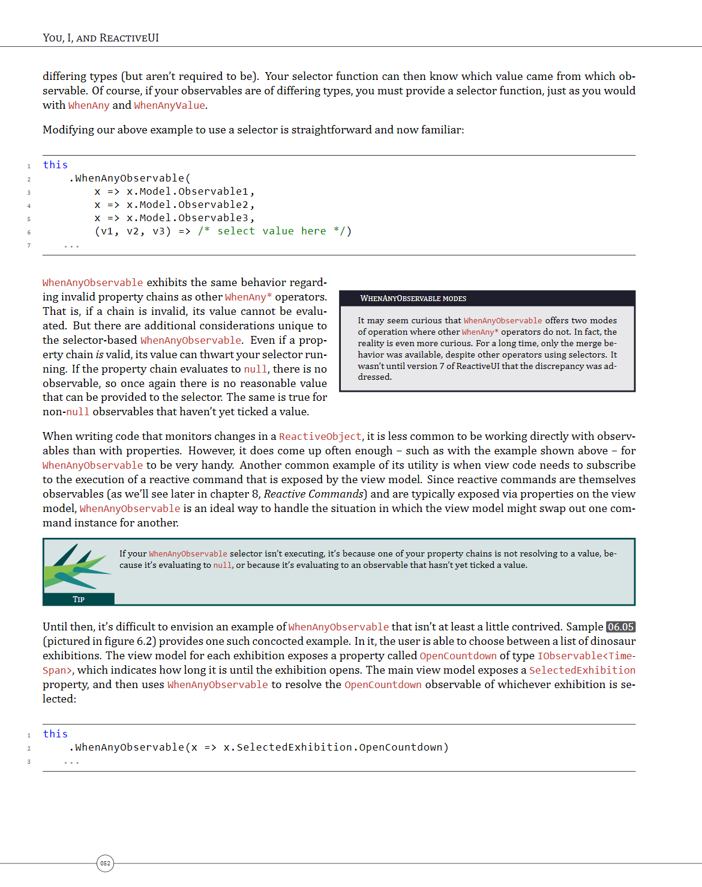

# You, I, and ReactiveUI Samples

[Buy the book](https://kent-boogaart.com/you-i-and-reactiveui/)

 
 

Hello!

I'm Kent, the author of these ReactiveUI code samples.  I want to make sure you're aware of my book &#x2013; _You, I, and ReactiveUI_ &#x2013; for which this code was written. Whilst I consider these samples useful in their own right, you will get _far_ more value out of them by studying them in conjunction with the book.

The book provides in-depth discussion on all things ReactiveUI, giving you the knowledge and understanding required to be highly effective with it. Whether you're new to ReactiveUI, or already proficient in it, I know you'll get a lot of value out of the book. To give you an idea of the content covered, here is the table of contents:

**Part 0: First Steps**
* Introduction
* A ReactiveUI Showcase
* Getting Started

**Part 1: Fundamentals**
* Splat
* ReactiveObject
* WhenAny and Friends
* ObservableAsPropertyHelper
* Reactive Commands
* Interactions
* Reactive Lists
* Message Bus

**Part 2: Platform Integration**
* Events
* IViewFor
* Bindings
* View Location
* ViewModelViewHost
* RoutedViewHost
* WhenActivated
* Auto Persistence

**Part 3: Best Practices**
* Composition
* Scheduling
* Error Handling
* Performance
* Testing
* Structure and Style

**Part 4: Appendices**
* Appendix A: Reactive Extensions 

On top of the extensive content and these fantastic code samples, I put a great deal of effort into typesetting the book. I think you'll agree that the result is a beautiful thing:

&nbsp;&nbsp;&nbsp;
 
&nbsp;&nbsp;&nbsp;

Hopefully I've convinced you that my efforts to create the very best resource for ReactiveUI programmers was worth it. If you want to support me and my work, please [buy the book](https://kent-boogaart.com/you-i-and-reactiveui/). If not, that's OK. I hope you get some value out of these samples all the same.

Best, 
Kent